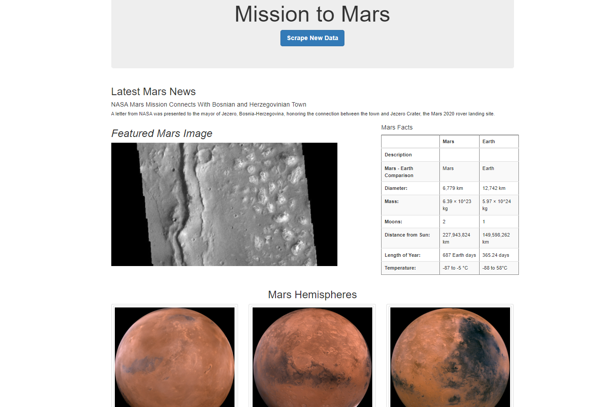
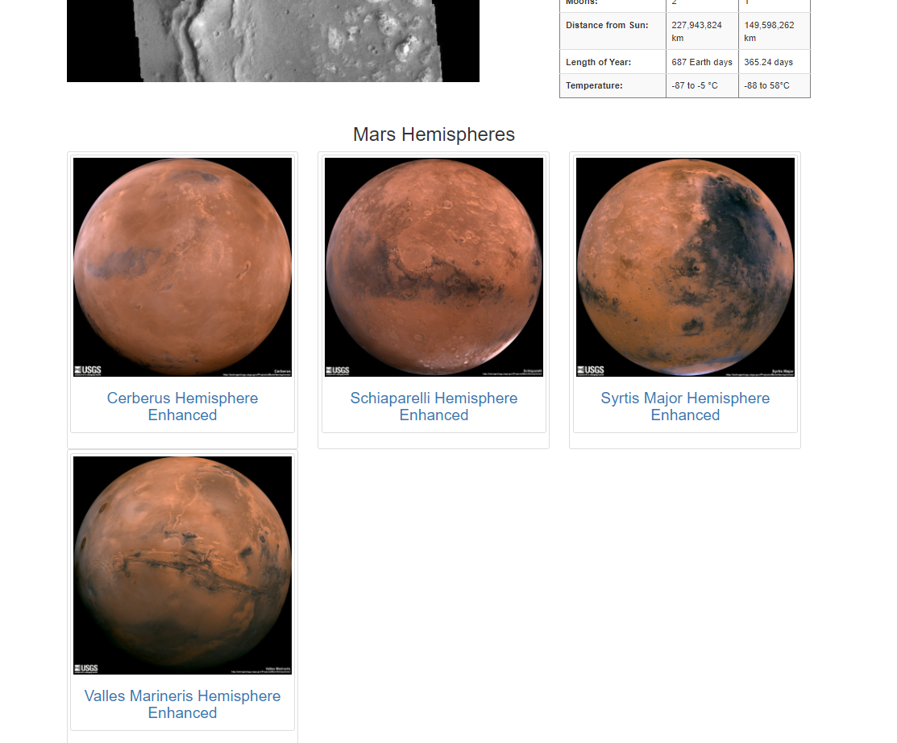
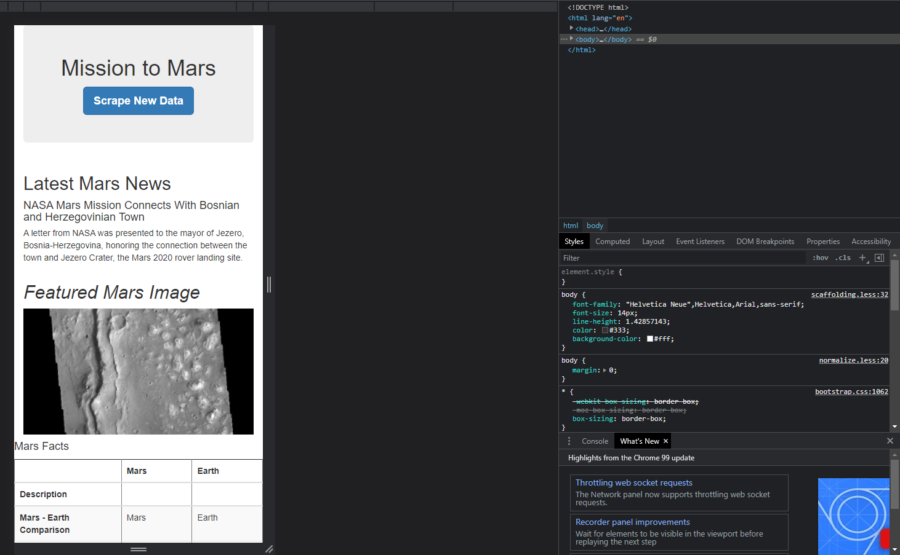

# Mission-to-Mars
The purpose of this analysis was to web scrape using a variety of tools to extract information from various websites. I used chrome developer tools to identify HTML elements attached to the data I was scraping. I then used BeautifulSoup and Splinter to automate the browser to retrieve data that was identified. I then used Mongo to store the data that was extracted and displayed the data in the web application using Flask.

## Results

Mission to Mars Web Application

Full-Resolution Mars Hemisphere Images

Mobile-Responive Application

